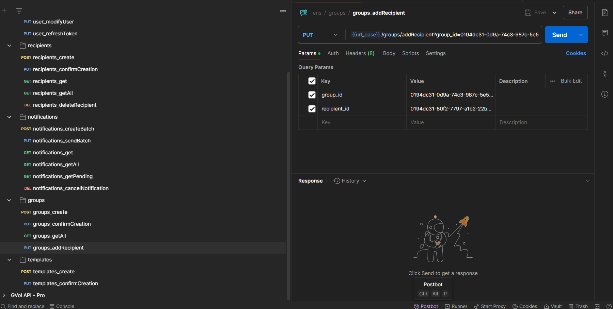
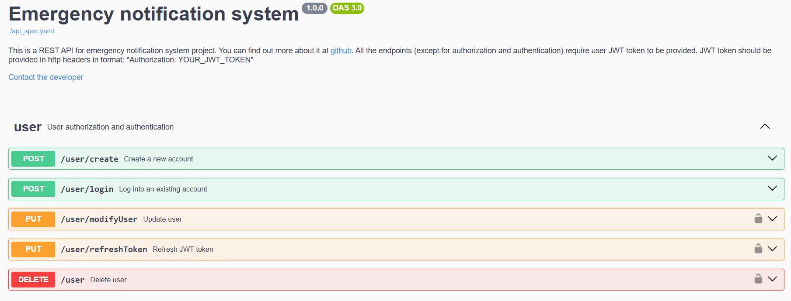
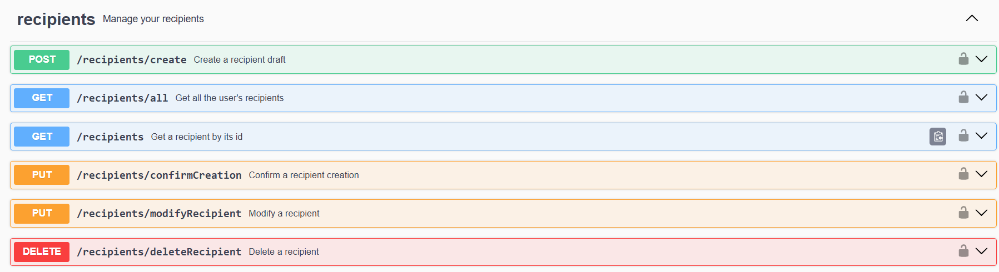
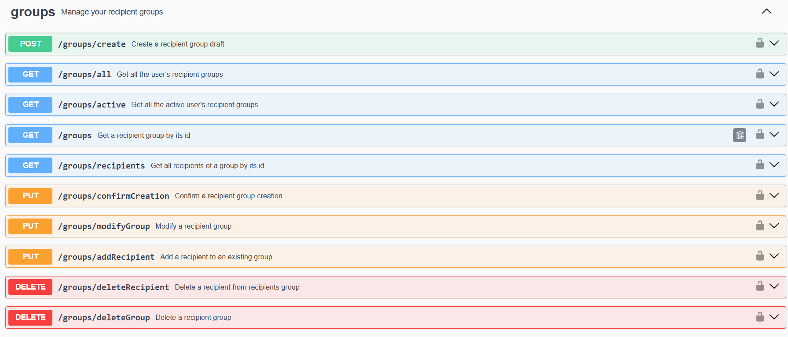
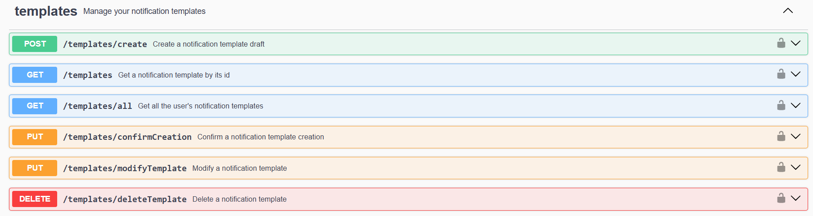
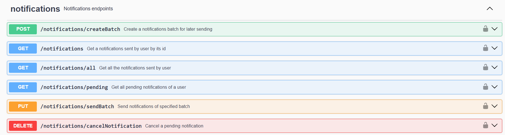

# Emergency Notification System

> This system allows you to quickly and efficiently send notifications to a large number of recipients during emergency
> situations.

## Functional requirements:

- [x] **Notification Sending:** Clients should be able to send notifications to the registered recipients, alerting them
  about emergency situations, through different communication channels, such as:
   - [ ] email
   - [x] telegram
   - [ ] push notifications
   - [ ] SMS
- [x] **Recipient Registration:** The system should support registering and grouping trusted recipients
- [x] **Notification Templates:**  The system should allow clients to create and manage pre-defined notification
  templates for instantaneous notifications sending.
- [ ] **Recipient Response:** Recipients should have the capability to respond to notifications, providing their safety
  status or any other pertinent information (e.g., indicating whether they are safe and currently located in a shelter).

## Non-functional requirements:

- [ ] **High Availability:** The system should be highly available, ensuring that it is accessible and operational even
  during peak usage or in the event of system failures.
- [ ] **Reliability:** The system should be reliable and deliver notifications consistently without any data loss.
- [ ] **Scalability:** The system should be able to handle a growing number of recipients and notifications without
  compromising performance or functionality.
- [x] **Security:** The system should have appropriate security measures in place to protect sensitive information,
  prevent unauthorized access, and ensure the privacy and integrity of data.

##

### Security

These steps ensure that only authorized users with valid JWT tokens can access the system and individual services
can make informed decisions based on the client's identity.

1. The client registers in the system, saving his account credentials.
2. The client sends his account credentials through the /user/login endpoint, receiving a pair of JWT tokens.
3. The client initiates a request to the API and includes a JWT token in the request headers.
4. The API intercepts the request and extracts the JWT token.
5. The extracted JWT token is validated by the API using a JWTManager component.
6. Upon successful validation, JWTManager component extracts a user ID.
7. User ID is then passed to the request handlers, providing them with user-specific information.

- In order to protect user data from database leaks, hashes of user passwords are stored instead of passwords themselves.
Moreover, random salt is applied to passwords for protection from brute-force attacks.

### Code Coverage

Both functional and manual tests are used to guarantee the correct work of the application. 
Functional tests were written using the pytest framework (https://github.com/pytest-dev/pytest/).
Postman was used for optimization of manual testing.

### Endpoints documentation
> The API endpoints are documented in the OpenAPI specification (swagger directory) and can be viewed through Swagger UI

